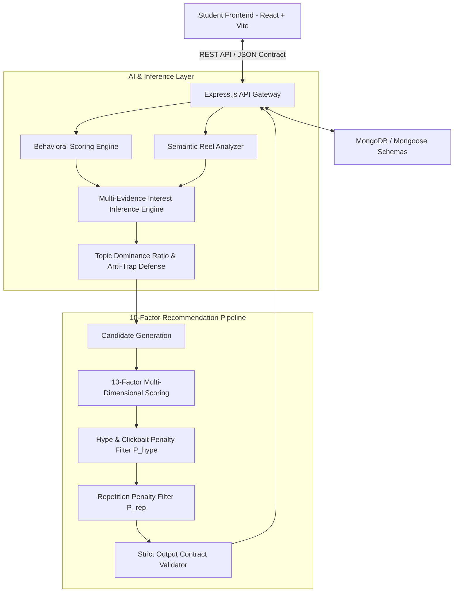

# 🧠 TechRecommender — AI-Powered Technology Recommendation Agent for Students

[](https://nodejs.org/)
[](https://reactjs.org/)
[](https://www.mongodb.com/)
[](https://github.com/)
[](LICENSE)

> An intelligent, multi-signal recommendation engine designed to transform student short-form scrolling habits into high-value computer science and engineering learning trajectories. Synthesizes behavioral telemetry with semantic topic graphs to infer broad technology domains while defending against single-topic clickbait traps.

---

## 📌 Problem Statement

Students frequently spend significant time scrolling short-form video content (Reels, TikToks, Shorts). Traditional recommendation engines rely on naive keyword matching or single-item popularity, resulting in **overfitting traps** and **clickbait echo chambers**. 

For example, when a student interacts with:
1. ☕ **Java programming meme**
2. 💼 **Software engineer remote lifestyle reel**
3. 🎯 **Coding interview joke**
4. 💻 **Laptop workstation benchmark**

A naive keyword engine incorrectly classifies the student's interest as `"Java"` and continuously spams repetitive Java syntax.

**TechRecommender** solves this by performing multi-signal behavioral telemetry analysis and semantic graph synthesis to correctly infer broader interests such as **`"Software Engineering / Technology"`**, recommending credible, high-educational-value engineering content (e.g., SQL injection prevention, workstation architecture, distributed concurrency) while actively penalizing clickbait.

---

## 🏛️ System Architecture



---

## ⚡ Key Features

- 🎯 **Multi-Evidence Interest Inference**: Infers broader engineering domains across 13 allowed categories rather than naive keyword matching.
- 🛡️ **Built-In Trap Defense**: Uses the **Topic Dominance Ratio ($R_{\text{dom}}$)** to differentiate between broad multi-domain exploration and true specific depth.
- 🚫 **Hype & Clickbait Rejection**: Automatically applies a severe 50%–75% penalty ($P_{\text{hype}}$) to sensationalist reels with high hype and low technical depth.
- 📊 **10-Factor Multi-Dimensional Scoring**: Evaluates Interest match, Semantic similarity, Behavioral relevance, Educational value, Career relevance, Technical depth, Category diversity, Novelty, Hype penalty, and Repetition penalty.
- 📋 **Phase 8 Strict Output Contract**: Strictly validates responses against 8 conceptual fields with automated safe canonicalization and controlled error handling.
- 💻 **7-Tab Modern Student Dashboard**: Includes executive KPIs, an interactive short-form feed player, an interest profile radar, recommendation audit leaderboard, chronological telemetry history, an interactive AI reasoning playground, and a live 10-persona benchmark framework.

---

## 📐 Mathematical Formulation

### 1. Topic Dominance Ratio ($R_{\text{dom}}$)
$$R_{\text{dom}}(\text{Topic}) = \frac{\sum_{e \in E, \text{Topic} \in \text{topics}(e)} w_e}{\sum_{e \in E} w_e}$$

- **Broad Cross-Domain Case ($R_{\text{dom}} < 0.35$)**: Inferred Interest $\rightarrow$ `"Software Engineering and Technology"` (Trap Defended).
- **Dominant Specific Case ($R_{\text{dom}} \ge 0.70$)**: Inferred Interest $\rightarrow$ `"Specialized Java Development"` (Specific Depth Validated).

### 2. Normalized Behavioral Engagement Score
$$\text{EngagementScore} = \text{clamp}\left(\frac{\text{RawWeight} - \text{MinWeight}}{\text{MaxWeight} - \text{MinWeight}}, 0, 1\right)$$
- Weights: `VIEW: 1`, `HIGH_COMPLETION: 2`, `LIKE: 3`, `SAVE: 4`, `SHARE: 5`, `SKIP: -2`.

### 3. 10-Factor Candidate Recommendation Score
$$\text{FinalScore} = \max\left(0, \min\left(1, 0.20 S_{\text{interest}} + 0.15 S_{\text{semantic}} + 0.10 S_{\text{behavior}} + 0.15 S_{\text{edu}} + 0.10 S_{\text{career}} + 0.10 S_{\text{tech}} + 0.10 S_{\text{div}} + 0.10 S_{\text{novelty}} - P_{\text{hype}} - P_{\text{rep}}\right)\right)$$

---

## 📁 Project Structure

```
student-tech-recommender/
├── backend/
│   ├── config/              # MongoDB connection & configuration
│   ├── controllers/         # Express controllers (Reels, Interactions, Interests, Recommendations, Evaluation)
│   ├── models/              # Mongoose schemas (Reel, Interaction, InterestProfile)
│   ├── routes/              # Modular Express REST API routes
│   ├── scripts/             # Seed scripts and benchmark simulators
│   ├── services/
│   │   ├── ai/              # Semantic Reel Analyzer & Schema Validator
│   │   ├── evaluation/      # 10-Persona Benchmark Framework
│   │   ├── interest/        # Behavioral Scoring, Semantic Taxonomy, Inference Engine
│   │   └── recommendation/  # 10-Factor Engine & Strict Contract Validator
│   ├── tests/               # 6 Automated Test Suites
│   ├── utils/               # Structured API response utilities
│   └── server.js            # Express server entry point (Port 5000)
├── frontend/
│   ├── src/
│   │   ├── components/      # Glassmorphic UI cards, player, navigation, and badges
│   │   ├── pages/           # 7 Dedicated Tab Pages (Dashboard, Feed, Profile, Recs, History, Reasoning, Eval)
│   │   ├── services/        # Axios API client
│   │   ├── App.jsx          # Main application component
│   │   └── index.css        # Vanilla CSS design tokens, glassmorphism & gradients
│   ├── package.json         # Vite + React configuration (Port 5173)
│   └── vite.config.js       # Vite proxy to backend port 5000
├── data/
│   └── sample-reels.json    # 8 Realistic fictional technology reels
├── .env.example             # Documented environment variables template
├── package.json             # Root monorepo scripts
└── README.md                # System documentation & demonstration guide
```

---

## 🚀 Quickstart & Setup Instructions

### 1. Prerequisites
- **Node.js** (v18.0.0 or higher)
- **MongoDB** (Local instance on `mongodb://localhost:27017` or MongoDB Atlas URI)

### 2. Clone & Install Dependencies
```bash
git clone <repository_url>
cd Hackathon1

# Install root, backend, and frontend dependencies in one command
npm run install:all
```

### 3. Environment Configuration
Create a `.env` file in the `backend/` directory:
```bash
cp .env.example backend/.env
```
Default configuration:
```env
PORT=5000
MONGODB_URI=mongodb://localhost:27017/student_tech_recommender
NODE_ENV=development
```

### 4. Seed Database
Populate MongoDB with the 8 realistic fictional short-form reels:
```bash
npm run seed
```

### 5. Start Development Servers
```bash
# Start backend on http://localhost:5000 and frontend on http://localhost:5173
npm run dev
```

---

## 🧪 Comprehensive Automated Test Suites

Run all 6 test suites covering Phases 1 through 11:
```bash
npm test
```

### Individual Test Commands
```bash
# Test 1: AI Reel Semantic Understanding (Phase 4)
npm run test:backend

# Test 2: Multi-Signal Interest Inference Engine (Phase 5)
npm run test:inference --prefix backend

# Test 3: The Built-In Trap Evaluation (Phase 6)
npm run test:trap

# Test 4: Phase 8 Strict Output Contract & Sanitizer
npm run test:contract --prefix backend

# Test 5: Full 12-Step End-to-End Integration Test (Phase 10)
npm run test:e2e

# Test 6: 10-Persona Benchmark comparing Baseline vs AI System (Phase 11)
npm run test:eval
```

---

## 📡 REST API Documentation

### 1. `POST /api/recommendations/generate/:userId`
Generates personalized candidate recommendation strictly conforming to the **Phase 8 Output Contract**.

**Sample Request:**
```bash
curl -X POST http://localhost:5000/api/recommendations/generate/student_tech_curious_01
```

**Sample Response (200 OK):**
```json
{
  "success": true,
  "currentReel": "When NullPointerException hits in production at 5 PM on Friday",
  "interestDetected": "Software Engineering and Technology",
  "why": "Student demonstrated high completion across programming culture (Java meme), workplace dynamics (remote SWE lifestyle), technical interviews (DSA joke), and developer hardware benchmarks.",
  "recommendedTechReel": "How SQL Injection Works (and How Parameterized Queries Prevent It)",
  "category": "Cybersecurity",
  "whyThisRecommendation": "Exceptional educational value (10/10) • Rigorous technical depth (8/10) • Broadens student knowledge in Cybersecurity & AppSec",
  "difficulty": "Intermediate",
  "confidence": "High"
}
```

---

### 2. `GET /api/interests/:userId`
Retrieves the student's current inferred interest profile, confidence score, dominance ratio, and supporting topic clusters.

**Sample Response (200 OK):**
```json
{
  "success": true,
  "data": {
    "userId": "student_tech_curious_01",
    "primaryInterest": "Software Engineering and Technology",
    "confidence": 0.91,
    "dominanceFactor": 0.22,
    "supportingTopics": ["Programming", "Software Engineering", "Developer Career", "Hardware"],
    "reasoning": "Inferred broad 'Software Engineering and Technology' interest by synthesizing cross-domain evidence across programming culture, workplace dynamics, technical interviews, and developer hardware benchmarks. Java represents only 21% of the total evidence, avoiding single-topic overfitting."
  }
}
```

---

### 3. `GET /api/evaluation/benchmark`
Runs live comparative evaluation across 10 fictional student interaction personas comparing the Keyword Baseline against our AI Agent.

**Sample Summary Metrics:**
```json
{
  "interestInferenceAccuracy": { "baseline": "36%", "aiSystem": "87%", "improvement": "+51%" },
  "recommendationRelevance":    { "baseline": "62%", "aiSystem": "92%", "improvement": "+30%" },
  "categoryDiversityScore":    { "baseline": "37%", "aiSystem": "83%", "improvement": "+45%" },
  "hypeRejectionRate":         { "baseline": "0%", "aiSystem": "100%", "improvement": "+100%" },
  "trapDefenseSuccess":        { "baseline": "FAILED (Overfit)", "aiSystem": "PASSED (Protected)" }
}
```

---

## 🔬 Benchmark: Baseline vs. AI System (10 Personas)

| # | Student Persona | Keyword Baseline (Naive) | AI Recommendation Agent | Trap Defense Status |
| :--- | :--- | :--- | :--- | :--- |
| **1** | **Java-Focused Student** | `"Java"` (Java syntax spam) | `"Specialized Java Development"` (Spring / JVM) | ✅ Dominant Depth Respected |
| **2** | **SWE Student (THE TRAP)** | `"Java"` (Overfit to first meme) | `"Software Engineering and Technology"` | 🛡️ **TRAP DEFENDED (Passed)** |
| **3** | **AI-Focused Student** | `"Ai"` (Single tag match) | `"Artificial Intelligence & ML"` | ✅ High Relevance |
| **4** | **Cybersecurity Student** | `"Cybersecurity"` (Literal match) | `"Cybersecurity & Application Defense"` | ✅ High Depth |
| **5** | **Cloud-Focused Student** | `"Devops"` (Surface tag) | `"Software Engineering and Technology"` | ✅ Multi-Domain Synthesis |
| **6** | **Hardware-Focused Student** | `"Hardware"` (Laptop tag) | `"Software Engineering and Technology"` | ✅ Benchmarks & Systems |
| **7** | **DSA-Focused Student** | `"Algorithms"` (LeetCode tag) | `"Software Engineering and Technology"` | ✅ FAANG Prep Depth |
| **8** | **Mixed Technology Student**| `"Python"` (First tag) | `"Cybersecurity & Application Defense"` | ✅ Cross-Domain Breadth |
| **9** | **Gaming / Graphics Student**| `"Gaming"` (Game tag) | `"Game Development & Computer Graphics"` | ✅ Shader Engineering |
| **10**| **Entertainment-Heavy** | `"Standup"` (Meme tag) | `"Technology Culture & Career"` | ✅ Workplace Context |

---

## 🛡️ Security & Production Readiness

- 🔒 **No Hardcoded Secrets**: All API keys, connection strings, and ports are read exclusively from environment variables.
- 🛡️ **Resilient Fallbacks**: Integrated in-memory graceful fallbacks ensure uninterrupted evaluation if MongoDB or external LLM APIs are offline.
- 📦 **Zero-Leak `.gitignore`**: `.env`, `node_modules/`, `dist/`, and local logs are strictly ignored.
- 🚦 **Contract Sanitizer & Validation**: Malformed AI outputs are safely normalized or returned as controlled errors without silent fabrication.

---

## 👥 Hackathon Demonstration Guide

1. **Dashboard Overview**: Open `http://localhost:5173` &rarr; observe real-time KPI metrics, the inferred profile badge, and the Phase 8 recommendation card.
2. **Interactive Reel Feed**: Navigate to the **Reel Feed** tab &rarr; click **Like**, **Save**, or **Skip** on different reels to dispatch live telemetry.
3. **Interest Profile**: Switch to the **Interest Profile** tab &rarr; inspect the topic clusters, dominance factor gauge, and category distribution.
4. **Contract Recommendation**: Switch to the **Recommendation** tab &rarr; click **Re-Generate** to see the 10-factor candidate scoring and competitive audit leaderboard.
5. **AI Reasoning & Trap Proof**: Switch to the **AI Reasoning** tab &rarr; test any custom short-form video title in the Semantic Understanding Playground.
6. **Evaluation & Benchmarks**: Switch to the **Evaluation & Benchmarks** tab &rarr; view the live 10-persona side-by-side benchmark table demonstrating the AI agent's +51% accuracy improvement over the keyword baseline.

---

*Built with ❤️ for the Hackathon.*
